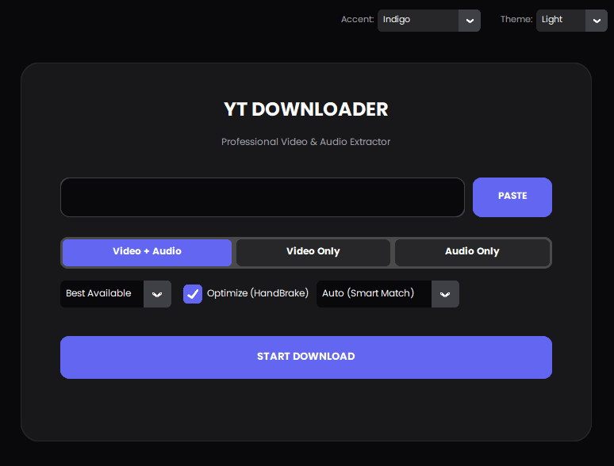

# Universal Downloader 🎬

**The High-Fidelity Universal Media Downloader & VFR Converter for Video Editors.**



## 🚀 Why Use This?

**Fix media glitches in Premiere Pro & DaVinci Resolve automatically.**

As a video editor, downloading clips from random sites often results in **VFR (Variable Frame Rate)** footage that glitches or de-syncs in professional editing software.

**Universal Downloader** solves this:

1. **Downloads** the highest quality stream.
2. **Trims** only the parts you need (saving bandwidth).
3. **Optimizes** via HandBrake engine to **CFR (Constant Frame Rate)**.
4. **Delivers** an edit-ready MP4 or high-quality Audio file.

---

## ✨ Key Features

- **🎨 Modern UI:** Sleek, dark-themed Glassmorphism interface built with Electron.
- **🐍 Python Power:** Uses `yt-dlp` for industry-standard download reliability.
- **✂️ Precision Trimming:** Download specific timestamps (e.g., 00:30 to 01:15) without downloading the whole video.
- **⚙️ Auto-HandBrake:** Automatically detects 4K/1080p and applies the correct compression preset.
- **🎧 Audio Extraction:** One-click conversion to MP3, WAV, M4A, or FLAC.
- **⚡ Smart Mode:** Selects the best settings automatically.

---

## 🌐 Supported Platforms

- Windows
- macOS
- Linux

## 📺 Supported Platforms

- **YouTube:** 4K Videos, Shorts, Live Streams, Playlists
- **Instagram:** Reels, Video Posts, IGTV
- **TikTok:** Videos (No Watermark)
- **Facebook:** Watch, Reels, Public Videos
- **Twitter (X):** Video Tweets
- **Twitch:** Clips, VODs (Past Broadcasts)
- **Reddit:** Videos, GIFs (Merged with Audio)
- **SoundCloud:** High-Quality Audio
- **Vimeo & Dailymotion:** HD Videos

---

## 🛠️ Tech Stack

This project uses a hybrid architecture:

- **Frontend:** Electron.js, HTML5, CSS3, Node.js (Handles the UI and Process Management).
- **Backend:** Python 3, `yt-dlp`, `ffmpeg`, `HandBrakeCLI` (Handles the heavy lifting).

---

## 📥 Installation & Setup

For quick setup, download the latest executable from the [Releases](https://github.com/amolbangare08/Universal-Downloader/releases) page, or follow the installation steps below.

Since this is a hybrid app, you need to set up both the Python environment and the Node.js environment.

### Prerequisites

1. **Node.js** (v14 or higher) - [Download](https://nodejs.org/)
2. **Python** (v3.8 or higher) - [Download](https://www.python.org/)
3. **FFmpeg** - Must be installed and added to your System PATH, or placed in the `backend/` folder.

### Step 1: Clone the Repository

```bash
git clone https://github.com/amolbangare08/Universal-Downloader.git
cd universal-downloader
```

### Step 2: Setup the Backend (Python)

Install the required Python libraries.

```bash
# Windows
pip install yt-dlp requests

# Mac/Linux
pip3 install yt-dlp requests
```

**Note:** Ensure `ffmpeg.exe` and `HandBrakeCLI.exe` are either in your system PATH or placed inside the `backend/` folder.

### Step 3: Setup the Frontend (Electron)

Navigate to the frontend folder and install dependencies.

```bash
cd frontend
npm install
```

---

## ▶️ How to Run

Once setup is complete, you can launch the application:

1. Open your terminal in the `frontend/` folder.
2. Run the start command:

```bash
npm start
```

The application window should appear.

---

## 🎮 How to Use

- **Paste URL:** Copy a YouTube or Instagram link and click **PASTE**.
- **Select Mode:**
  - **Video + Audio:** Standard video download.
  - **Video Only:** Good for stock footage (no sound).
  - **Audio Only:** Extracts music/speech.
- **Configure Options:**
  - **Quality:** Select resolution (up to 4K).
  - **Cut/Trim:** Toggle ON to specify Start and End times.
  - **Optimize:** Toggle ON to run the video through HandBrake (recommended for editing).
- **Download:** Click **START DOWNLOAD**, select your destination folder, and watch the progress bar.

---

## 📂 Project Structure

```plaintext
universal-downloader/
├── backend/                # The Brains (Python)
│   ├── cli.py              # The bridge between Electron and Python
│   ├── core.py             # Configs and utilities
│   ├── downloaders.py      # Download logic engine
│   ├── ffmpeg.exe          # (Optional) Binary
│   └── HandBrakeCLI.exe    # (Optional) Binary
│
├── frontend/               # The Face (Electron)
│   ├── main.js             # Electron main process
│   ├── index.html          # UI Layout
│   ├── style.css           # Styling
│   ├── script.js           # UI Logic
│   └── package.json        # Node dependencies
│
└── README.md
```

---

## 🛡️ Troubleshooting

### Download doesn't start?

- Ensure Python is installed and added to your PATH.
- Open the developer console in the app (`Ctrl + Shift + I`) to see error logs.

### "FFmpeg not found" error?

- The app looks for `ffmpeg.exe` in the `backend/` folder or your system PATH.
- Download a static build of FFmpeg and place the `.exe` inside `backend/`.

---

## 🤝 Contributing

- Fork the Project.
- Create your Feature Branch (`git checkout -b feature/AmazingFeature`).
- Commit your Changes (`git commit -m 'Add some AmazingFeature'`).
- Push to the Branch (`git push origin feature/AmazingFeature`).
- Open a Pull Request.

License: MIT

---

## 💰 Donations

If you find this project useful, consider supporting its development!

**Bitcoin:** 🪙 ```
1FVP7EdQZ4GmDpv4VvZUBUMm3B5MLLq2P3```

---

## 📄 License

Distributed under the MIT License. See `LICENSE` for more information.

**Built by Editors, for Editors.**
