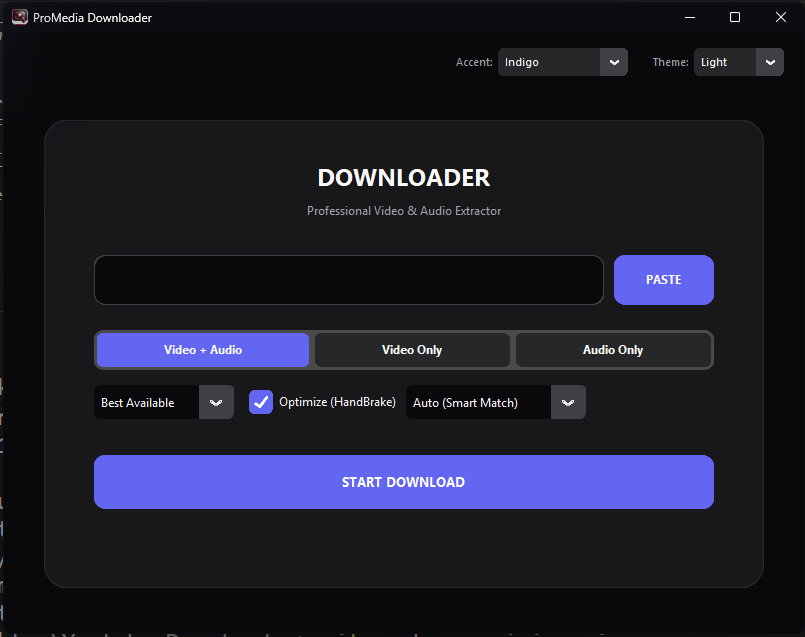

# ProMedia Downloader 🎬

**The High-Fidelity YouTube Downloader built for Video Editors.**



## 🛑 The Problem
As a Premiere Pro editor, you know the pain:
1. You download a clip from YouTube.
2. It plays fine in a player, but **glitches, lags, or de-syncs** inside Premiere Pro.
3. **Why?** Because YouTube videos use **VFR (Variable Frame Rate)**, which professional NLEs hate.
4. **The Fix:** You have to manually run it through HandBrake to convert it to **CFR (Constant Frame Rate)**.

## ✅ The Solution
**ProMedia Downloader** automates this workflow. It downloads the highest quality video and **automatically passes it through the HandBrake engine** in the background.

**Result:** You get a buttery smooth, edit-ready **MP4 (H.264, CFR)** file that works perfectly in Premiere Pro, DaVinci Resolve, and After Effects. No more manual transcoding.

## ✨ Key Features
- **Auto-HandBrake Integration:** Converts VFR to CFR instantly (essential for editing).
- **4K & 8K Support:** Downloads the highest resolution streams available.
- **Smart Proxy System:** Bypasses "Bot/Sign-in" restrictions using a rotating proxy list.
- **Adaptive UI:** Professional Dark/Light themes that sync with your Windows accent color.
- **Format Control:** Download Video+Audio, Video Only, or Audio Only (MP3/WAV).

## 🚀 How to Install

### Option 1: The Easy Way (Recommended)
1. Go to the [**Releases Page**](https://github.com/amolbangare08/ProMedia-Downloader/releases).
2. Download the latest `ProMedia.Downloader.exe`.
3. Run the app (No installation or Python required).

### Option 2: For Developers (Run from Source)
1. Clone this repository:
   ```bash
   git clone [https://github.com/amolbangare08/ProMedia-Downloader.git](https://github.com/amolbangare08/ProMedia-Downloader.git)